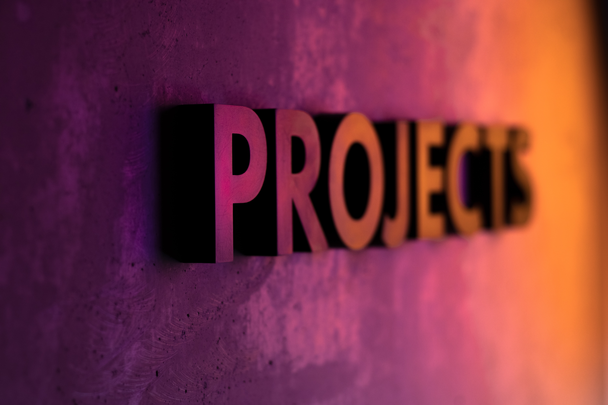

# Portfolio v3

<div align="center">

**John Jerome F. Bernal** — Software Engineer

[](https://reactjs.org/)
[](https://mui.com/)
[](https://www.framer.com/motion/)
[](https://nodejs.org/)

[Live demo](#) · [Report bug](https://github.com/JerrrStack/Portfolio-v3/issues) · [Request feature](https://github.com/JerrrStack/Portfolio-v3/issues)

</div>

---

A modern, dark-themed personal portfolio built with **Create React App**. Showcases skills, experience, personal projects, and contact—designed for clarity, responsiveness, and a professional but approachable tone.

## ✨ Features

- **Hero** — Experience highlights, stats, and quick CTAs (projects, contact, CV, GitHub)
- **About** — Personal intro focused on growth and collaboration
- **Skills** — Categorized stack with progress bars and tech chips
- **Experience** — Timeline of roles and responsibilities
- **Projects** — Personal work only (public repos & demos; professional work stays confidential)
- **Contact** — Gmail compose integration with form prefill
- **Responsive** — Desktop nav + mobile menu, fluid layouts
- **Motion** — Subtle Framer Motion on hero and project cards

## 🛠 Tech stack

| Area | Tools |
|------|--------|
| UI | React 17, Material UI v4, custom theme |
| Motion | Framer Motion |
| Navigation | react-scroll |
| Notifications | react-toastify |
| Fonts | Plus Jakarta Sans, JetBrains Mono |
| Build | Create React App (react-scripts 4) |

## 🚀 Getting started

### Prerequisites

- **Node.js** 24.x (Vercel) or 18+ locally (OpenSSL flag required for react-scripts 4)

### Install & run

```bash
git clone https://github.com/JerrrStack/Portfolio-v3.git
cd Portfolio-v3
npm install
npm start
```

Open [http://localhost:3000](http://localhost:3000).

### Production build

```bash
npm run build
```

Serve the `build/` folder (e.g. `npx serve -s build`).

### Node 17+ (OpenSSL)

`npm start` and `npm run build` use `cross-env` to set `NODE_OPTIONS=--openssl-legacy-provider` (required for Create React App 4 on modern Node).

## 📁 Project structure

```
src/
├── components/     # Header, About, Skills, Projects, Contact, Footer, Nav
├── static/         # profile.js, projects.js — edit content here
├── theme/          # Colors, layout, typography tokens
└── styles/         # Global CSS
public/
└── assets/         # Images, CV, favicon
```

**Tip:** Most copy and links live in `src/static/profile.js` and `src/static/projects.js`.

## 🔗 Links

| | |
|---|---|
| GitHub | [@JerrrStack](https://github.com/JerrrStack) |
| Email | johnjeromebernal@gmail.com |
| Social demo | [jer-social-media](https://jer-social-media.herokuapp.com/login) |
| Portfolio V2 | [Jerome-Portfolio-V2](https://github.com/JerrrStack/Jerome-Portfolio-V2) |

## 📸 Preview

> Add a screenshot to `public/assets/` and link it here after deploy.

```markdown

```

## 📄 License

This project is open for portfolio and learning purposes. Feel free to fork and adapt—credit appreciated.

---

<div align="center">

**Keep stacking knowledge.**

Made with ☕ by [John Jerome F. Bernal](https://github.com/JerrrStack)

</div>
